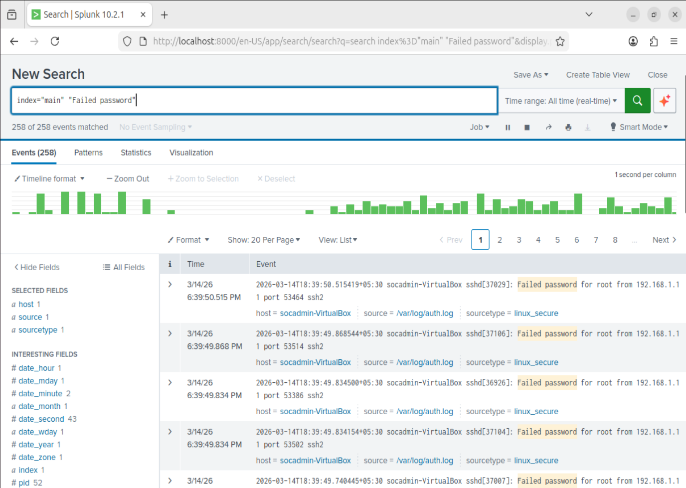
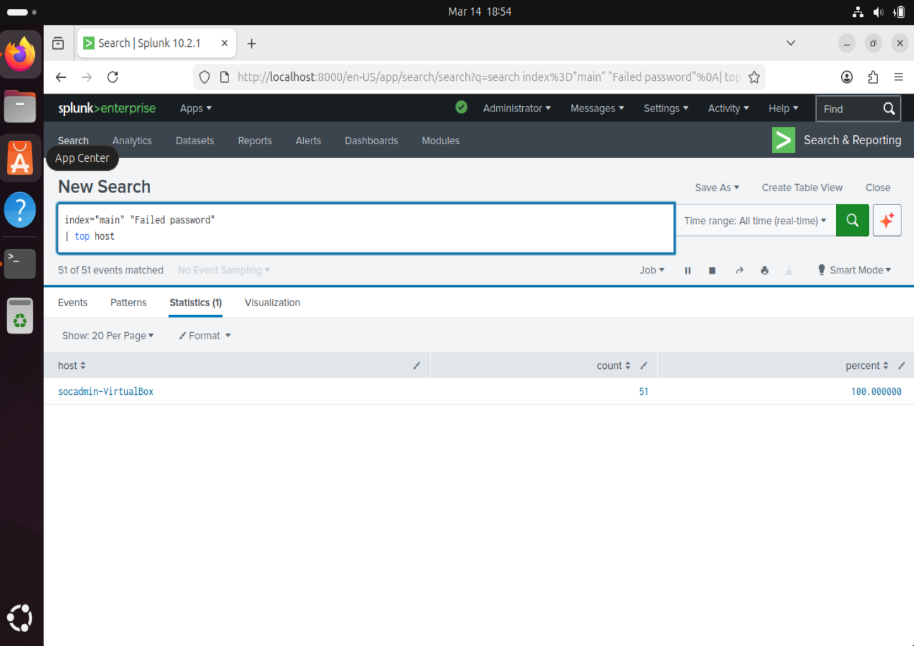
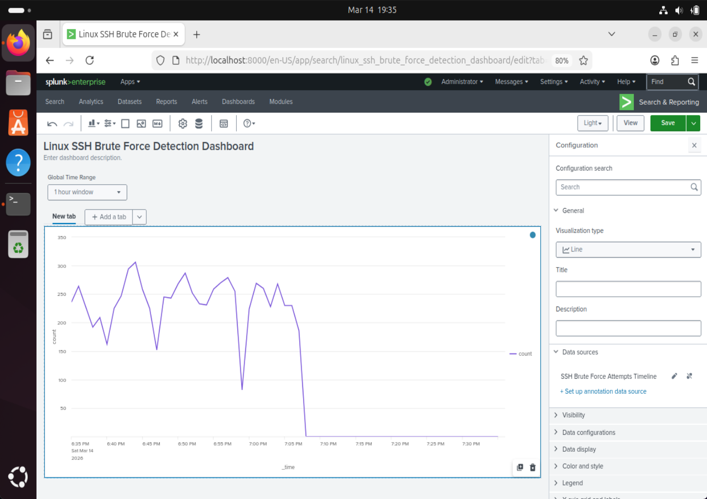
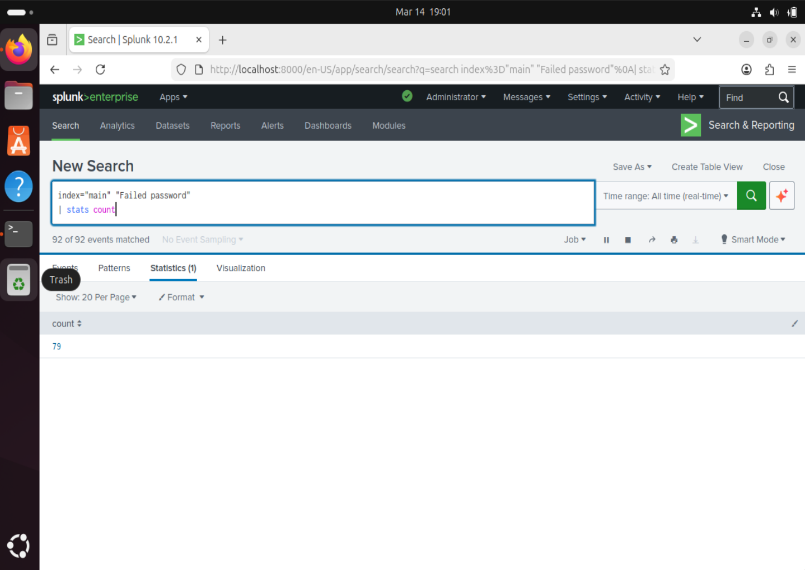
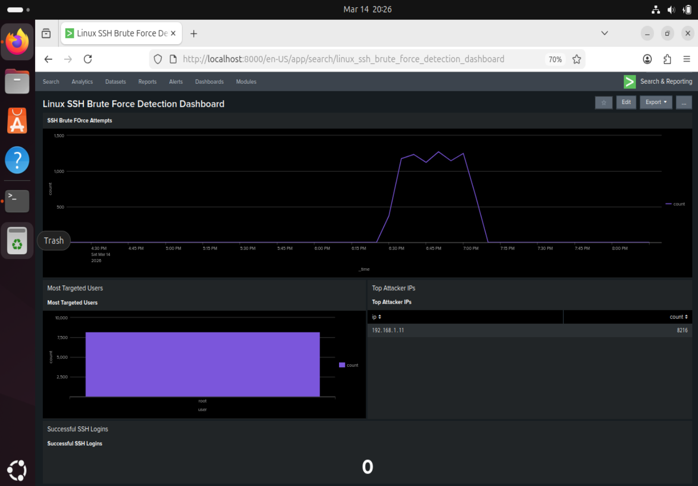

# 🔐 Linux SSH Brute Force Detection Using Splunk SIEM

## Project Overview

This project simulates a real-world **SSH brute-force attack** against a Linux server and demonstrates how a Security Operations Center (SOC) analyst detects, investigates, and responds to such incidents using **Splunk Enterprise SIEM**.

An attacker machine (Kali Linux) uses **Hydra** to perform automated credential-guessing attacks via SSH against an Ubuntu Server. The authentication logs generated on the target are ingested into Splunk, where custom search queries and a purpose-built detection dashboard are used to identify the attack, profile the attacker, and confirm whether any compromise occurred.

---

## Lab Architecture

```
┌─────────────────────┐        SSH Brute Force       ┌─────────────────────┐
│   ATTACKER MACHINE  │ ──────────────────────────▶   │   TARGET MACHINE    │
│                     │        (Port 22)              │                     │
│   Kali Linux        │                               │   Ubuntu Server     │
│   IP: 192.168.1.11  │                               │   IP: 192.168.1.2   │
│   Tool: Hydra v9.6  │                               │   User: socadmin    │
│   User: Clowny      │                               │                     │
└─────────────────────┘                               └────────┬────────────┘
                                                               │
                                                     Auth Logs │ /var/log/auth.log
                                                               │
                                                               ▼
                                                  ┌─────────────────────────┐
                                                  │    MONITORING SYSTEM    │
                                                  │                        │
                                                  │   Splunk Enterprise    │
                                                  │   v10.2.1              │
                                                  │   Index: main          │
                                                  │   Sourcetype:          │
                                                  │     linux_secure       │
                                                  └─────────────────────────┘
```

---

## Tools Used

| Tool                          | Role                                                        |
| ----------------------------- | ----------------------------------------------------------- |
| **Kali Linux**                | Attacker operating system for penetration testing           |
| **Ubuntu Server**             | Target machine running SSH service                          |
| **Hydra v9.6**                | Automated SSH brute-force / password-cracking tool          |
| **rockyou.txt**               | Password wordlist (14.3M entries) used by Hydra             |
| **Splunk Enterprise v10.2.1** | SIEM platform for log ingestion, analysis, and dashboarding |
| **VirtualBox**                | Virtualization platform hosting the lab environment         |

---

## Attack Simulation

The SSH brute-force attack was launched from the Kali Linux machine using **Hydra**:

```bash
hydra -l root -P /home/Clowny/Desktop/rockyou.txt -t 16 -f ssh://192.168.1.2
```

| Parameter           | Purpose                                                |
| ------------------- | ------------------------------------------------------ |
| `-l root`           | Target the `root` user account                         |
| `-P rockyou.txt`    | Use the RockYou password wordlist (14,344,398 entries) |
| `-t 16`             | Run 16 parallel threads                                |
| `-f`                | Stop on first successful login                         |
| `ssh://192.168.1.2` | Target SSH service on port 22                          |

**Result:** Hydra performed **8,216 login attempts** at a rate of ~183–244 attempts per minute. The attack was **unsuccessful** — zero passwords were cracked.

---

## Log Ingestion

Ubuntu authentication logs (`/var/log/auth.log`) were forwarded to Splunk Enterprise for centralized monitoring:

- **Index:** `main`
- **Source:** `/var/log/auth.log`
- **Sourcetype:** `linux_secure`
- **Host:** `socadmin-VirtualBox`
- **Total Events Collected:** 701

The logs captured SSH authentication events including all `Failed password` entries generated by the brute-force attack, enabling real-time detection and analysis.

---

## Detection Queries

The following **SPL (Search Processing Language)** queries were used to detect and analyze the attack:

### 1. Verify Log Ingestion

```spl
index="main" source="/var/log/auth.log"
```

> Returns all ingested authentication events (701 events).

### 2. Detect Failed Password Attempts

```spl
index="main" "Failed password"
```

> Filters for brute-force indicators — returned **258 failed password events**.

### 3. Identify Targeted Hosts

```spl
index="main" "Failed password" | top host
```

> Shows which hosts were targeted — **socadmin-VirtualBox** (100% of events).

### 4. Count Total Failed Logins

```spl
index="main" "Failed password" | stats count
```

> Aggregates total failed login attempts — count of **79** (point-in-time snapshot).

### 5. Brute-Force Timeline (Dashboard)

```spl
index="main" "Failed password" | timechart count
```

> Visualizes attack volume over time — used in the detection dashboard.

### 6. Top Attacker IPs (Dashboard)

```spl
index="main" "Failed password" | stats count by src_ip
```

> Identifies attacker source — **192.168.1.11** with **8,216 attempts**.

### 7. Most Targeted Users (Dashboard)

```spl
index="main" "Failed password" | stats count by user
```

> Shows the **root** account as the sole target.

---

## Dashboard Monitoring

A custom **"Linux SSH Brute Force Detection Dashboard"** was built in Splunk with the following panels:

| Panel                        | Visualization    | Finding                                                                |
| ---------------------------- | ---------------- | ---------------------------------------------------------------------- |
| **SSH Brute Force Attempts** | Line Chart       | Attack spike from ~6:30 PM to ~7:10 PM, peaking at 1,100+ attempts/min |
| **Most Targeted Users**      | Bar Chart        | `root` — sole targeted account (~8,000+ attempts)                      |
| **Top Attacker IPs**         | Statistics Table | `192.168.1.11` — **8,216 attempts**                                    |
| **Successful SSH Logins**    | Single Value     | **0** — No successful logins                                           |

---

## MITRE ATT&CK Mapping

| Field             | Value                                 |
| ----------------- | ------------------------------------- |
| **Tactic**        | Credential Access (TA0006)            |
| **Technique**     | T1110 — Brute Force                   |
| **Sub-Technique** | T1110.001 — Password Guessing         |
| **Tool**          | Hydra v9.6                            |
| **Target**        | SSH (TCP/22)                          |
| **Detection**     | SIEM Log Analysis (Splunk Enterprise) |

> **T1110 — Brute Force:** Adversaries may use brute-force techniques to attempt access to accounts when passwords are unknown. This technique involves systematically attempting passwords from a wordlist to authenticate to a service. In this lab, Hydra was used to attempt SSH authentication with the `rockyou.txt` wordlist against the `root` account.

---

## Screenshots

### 1. Attacker Machine — Kali Linux IP Configuration


### 2. Target Machine — Ubuntu Server IP Configuration


### 3. Splunk Log Ingestion — Authentication Events


### 4. Hydra Brute-Force Attack Execution


### 5. Brute-Force Detection — Failed Password Events



### 6. Attack Source Analysis — Host Identification



### 7. Attack Timeline — Brute-Force Attempts Over Time



### 8. Failed Login Count — Total Attempt Quantification



### 9. Complete Detection Dashboard



---

## Skills Demonstrated

- **SIEM Administration** — Configuring Splunk Enterprise for log ingestion and real-time monitoring
- **Log Analysis** — Parsing and interpreting Linux authentication logs (`auth.log`)
- **Threat Detection** — Identifying SSH brute-force attack patterns using SPL queries
- **Incident Investigation** — Profiling attacker behavior, establishing timeline, and determining impact
- **Dashboard Engineering** — Building custom Splunk dashboards for security monitoring
- **Attack Simulation** — Safely executing penetration testing techniques in a controlled lab
- **MITRE ATT&CK Framework** — Mapping observed adversary behavior to standardized techniques
- **Incident Response** — Formulating containment and mitigation strategies
- **Network Forensics** — Analyzing network configurations and attack vectors
- **Technical Documentation** — Producing professional-grade investigation reports

---

## Conclusion

This project demonstrates a complete **SOC analyst workflow** from attack simulation through detection and investigation:

1. **Environment Setup** — Configured an isolated lab with attacker (Kali Linux), target (Ubuntu Server), and monitoring (Splunk SIEM) systems
2. **Attack Execution** — Performed an SSH brute-force attack using Hydra with the rockyou.txt wordlist (8,216 attempts)
3. **Log Collection** — Ingested authentication logs into Splunk for centralized analysis
4. **Detection** — Used SPL queries to identify 258+ failed password events originating from a single attacker IP
5. **Investigation** — Built a detection dashboard confirming the attacker IP (`192.168.1.11`), targeted account (`root`), and **zero successful logins**
6. **Response** — Documented mitigation strategies including Fail2Ban, SSH key-based authentication, and SIEM alerting

The attack was **fully detected and unsuccessful**, demonstrating the effectiveness of SIEM-based monitoring in identifying credential-based attacks in real time.

---

## 📄 Related Documentation

- [SOC Incident Investigation Report](investigation_report.md) — Detailed security investigation report for this incident
