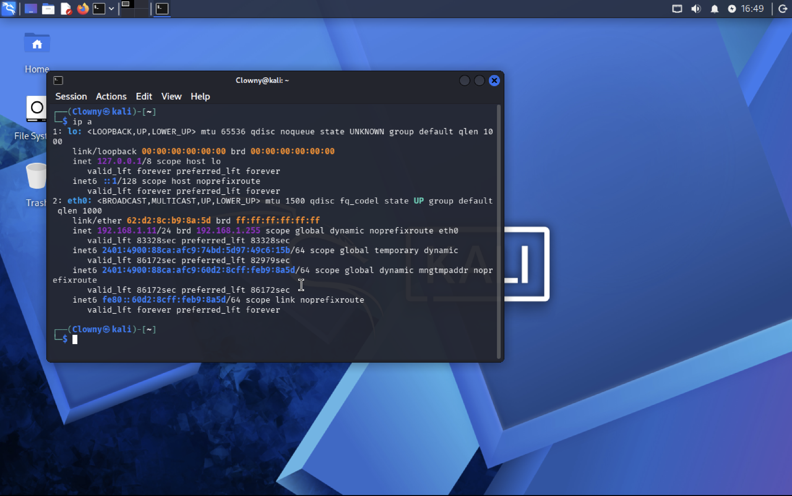
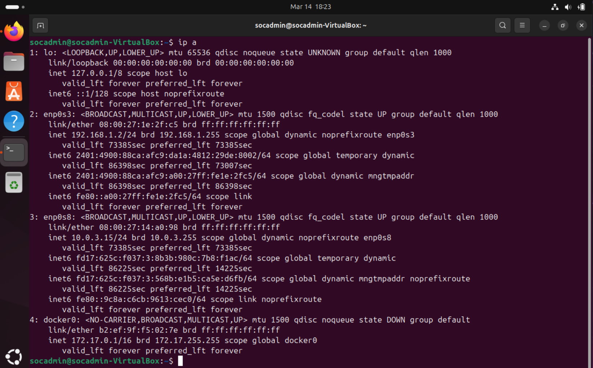
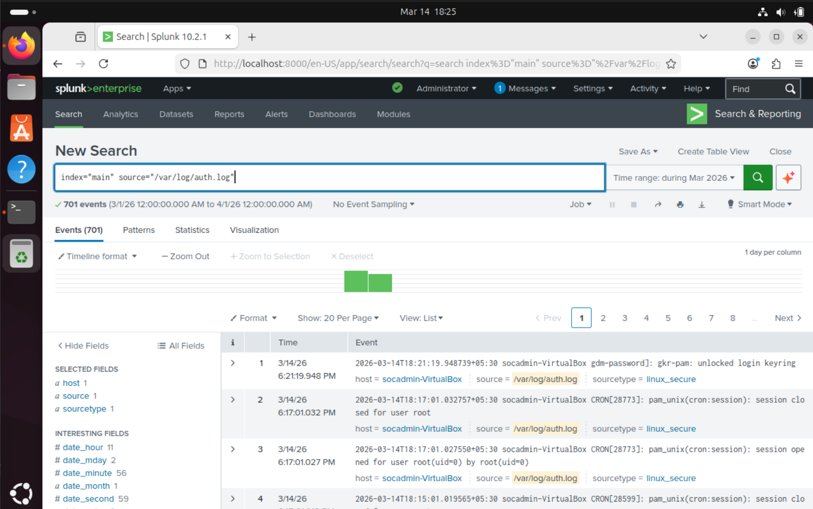
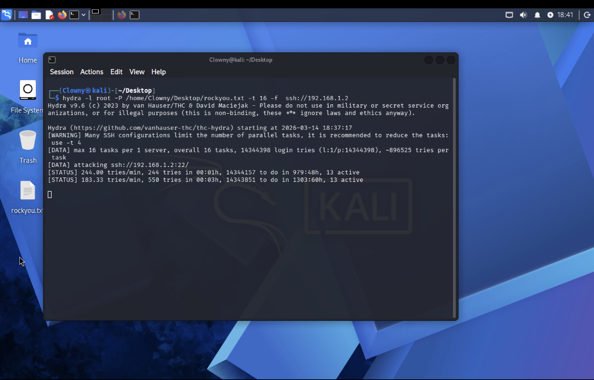

# Security Incident Investigation Report

**Report ID:** SOC-2026-0314-001
**Date of Investigation:** March 14, 2026
**Analyst:** SOC Tier 1 Analyst
**Classification:** Brute-Force Attack — SSH Authentication
**Severity:** High
**Status:** Closed — Attack Unsuccessful

---

## 1. Incident Overview

On **March 14, 2026**, the Security Operations Center (SOC) detected a high-volume SSH brute-force attack targeting a Linux server within the internal network. The attack originated from a Kali Linux machine (`192.168.1.11`) and targeted the Ubuntu Server (`192.168.1.2`) on SSH port 22.

The attacker utilized **Hydra v9.6**, a well-known password-cracking tool, along with the **rockyou.txt** wordlist to perform automated credential-guessing attempts against the `root` account. The attack was identified and analyzed using **Splunk Enterprise SIEM (v10.2.1)**, which ingested authentication logs from the target system and surfaced anomalous login behavior through search queries and a custom detection dashboard.

**Investigation Objective:** Analyze the brute-force attack, determine the scope of compromise, identify the attacker, and recommend mitigation strategies.

---

## 2. Environment Description

| Component            | Details                                                          |
| -------------------- | ---------------------------------------------------------------- |
| **Attacker Machine** | Kali Linux (hostname:`kali`, user: `Clowny`)                     |
| **Attacker IP**      | `192.168.1.11` (interface `eth0`)                                |
| **Target Machine**   | Ubuntu Server (hostname:`socadmin-VirtualBox`, user: `socadmin`) |
| **Target IP**        | `192.168.1.2` (interface `enp0s3`)                               |
| **SIEM Platform**    | Splunk Enterprise v10.2.1                                        |
| **Log Source**       | `/var/log/auth.log` (sourcetype: `linux_secure`)                 |
| **Splunk Index**     | `main`                                                           |
| **Network Segment**  | `192.168.1.0/24` (internal lab network)                          |
| **Virtualization**   | VirtualBox (both attacker and target are VMs)                    |

---

## 3. Attack Simulation

The brute-force attack was executed from the Kali Linux attacker machine using the following command:

```bash
hydra -l root -P /home/Clowny/Desktop/rockyou.txt -t 16 -f ssh://192.168.1.2
```

### Command Breakdown

| Parameter | Value                              | Description                                                  |
| --------- | ---------------------------------- | ------------------------------------------------------------ |
| `-l`      | `root`                             | Target username for the SSH login attempts                   |
| `-P`      | `/home/Clowny/Desktop/rockyou.txt` | Path to the password wordlist (RockYou — 14,344,398 entries) |
| `-t`      | `16`                               | Number of parallel tasks (threads)                           |
| `-f`      | —                                  | Stop on first successful login                               |
| Target    | `ssh://192.168.1.2`                | SSH service on port 22 of the Ubuntu target                  |

### Attack Execution Details

- **Tool:** Hydra v9.6 (by van Hauser/THC & David Maciejak)
- **Start Time:** `2026-03-14 18:37:17`
- **Total Login Combinations:** 14,344,398 (`l:1/p:14344398`)
- **Max Threads:** 16 parallel tasks per server
- **Estimated Tries per Task:** ~896,525
- **Observed Rate:** 183–244 attempts per minute
- **Target:** `ssh://192.168.1.2:22/`

The tool output indicated **13 active threads** during execution and provided status updates showing the volume and pace of the attack.

---

## 4. Log Collection and Monitoring

Authentication logs from the Ubuntu target server were forwarded to Splunk Enterprise for centralized monitoring and analysis.

### Ingestion Details

- **Log Source:** `/var/log/auth.log`
- **Sourcetype:** `linux_secure`
- **Splunk Index:** `main`
- **Host:** `socadmin-VirtualBox`
- **Total Events Ingested:** **701 events** (during March 2026 time range)
- **Time Range Queried:** `3/1/26 12:00:00.000 AM` to `4/1/26 12:00:00.000 AM`

### Initial Query

```spl
index="main" source="/var/log/auth.log"
```

This query confirmed that authentication events were being successfully collected and indexed by Splunk, including session management events (`pam_unix(cron:session)`), keyring unlocks (`gkr-pam: unlocked login keyring`), and SSH authentication events (`sshd`).

---

## 5. Evidence Analysis

### Evidence 1 — Attacker Machine Identification



**What it shows:** The Kali Linux terminal displaying the output of the `ip a` command.

**Technical Evidence:**

- Hostname: `kali` (user: `Clowny`)
- Network Interface: `eth0` — state **UP**
- IPv4 Address: **`192.168.1.11/24`**
- MAC Address: `62:d2:8c:b9:8a:5d`
- Broadcast Address: `192.168.1.255`

**Investigation Stage:** Pre-attack reconnaissance — establishing attacker network identity.

---

### Evidence 2 — Target Machine Identification



**What it shows:** The Ubuntu Server terminal displaying the output of the `ip a` command.

**Technical Evidence:**

- Hostname: `socadmin-VirtualBox` (user: `socadmin`)
- Primary Network Interface: `enp0s3` — state **UP**
- IPv4 Address: **`192.168.1.2/24`**
- MAC Address: `08:00:27:1e:2f:c5`
- Additional Interfaces: `enp0s8` (`10.0.3.15/24`), `docker0` (`172.17.0.1/16` — state DOWN)

**Investigation Stage:** Pre-attack environment documentation — confirming the target system's network configuration and attack surface.

---

### Evidence 3 — Log Ingestion Verification in Splunk



**What it shows:** Splunk Search & Reporting interface displaying ingested events from `/var/log/auth.log`.

**Technical Evidence:**

- SPL Query: `index="main" source="/var/log/auth.log"`
- Total Events: **701**
- Time Range: March 2026
- Source: `/var/log/auth.log`
- Sourcetype: `linux_secure`
- Host: `socadmin-VirtualBox`
- Events include cron session management and PAM authentication entries dated `3/14/26`

**Investigation Stage:** SIEM configuration validation — confirming that authentication logs are being collected and indexed for analysis.

---

### Evidence 4 — Hydra Brute-Force Attack Execution



**What it shows:** The Kali Linux terminal displaying the Hydra tool executing an SSH brute-force attack.

**Technical Evidence:**

- Command: `hydra -l root -P /home/Clowny/Desktop/rockyou.txt -t 16 -f ssh://192.168.1.2`
- Hydra Version: **v9.6**
- Attack Start: `2026-03-14 18:37:17`
- Wordlist: `rockyou.txt` (14,344,398 password entries)
- Status at 1 min: 244 tries/min, 244 total attempts
- Status at 3 min: 183.33 tries/min, 550 total attempts
- Active Threads: 13
- The file `rockyou.txt` is visible on the Kali desktop

**Investigation Stage:** Active attack phase — the adversary is executing the brute-force attack against the target SSH service.

---

### Evidence 5 — Brute-Force Detection in Splunk


**What it shows:** Splunk search results filtering for "Failed password" events, revealing the brute-force attack.

**Technical Evidence:**

- SPL Query: `index="main" "Failed password"`
- Matched Events: **258 events**
- Time Range: All time (real-time)
- All events show: `Failed password for root from 192.168.1.1` (the attacker IP)
- Events are timestamped around `2026-03-14 18:39:49–50 PM`
- Source: `/var/log/auth.log`
- Sourcetype: `linux_secure`
- The histogram timeline shows a concentrated burst of activity
- Multiple SSH PIDs visible (e.g., `sshd[37029]`, `sshd[37106]`, `sshd[36926]`)

**Investigation Stage:** Detection phase — Splunk SIEM successfully identified the pattern of repeated failed authentication attempts characteristic of a brute-force attack.

---

### Evidence 6 — Attack Source Analysis


**What it shows:** Splunk statistical analysis identifying the host targeted by the failed password events.

**Technical Evidence:**

- SPL Query: `index="main" "Failed password" | top host`
- Results: `socadmin-VirtualBox` — **51 events** (100.000000%)
- This confirms that all failed password events originated against a single host

**Investigation Stage:** Analysis phase — correlating failed login attempts to the target host to confirm scope of attack.

---

### Evidence 7 — Attack Timeline Visualization


**What it shows:** Splunk dashboard with a line chart visualizing the SSH brute-force attempts over time.

**Technical Evidence:**

- Dashboard Title: **"Linux SSH Brute Force Detection Dashboard"**
- Data Source: **"SSH Brute Force Attempts Timeline"**
- Visualization Type: Line chart
- Global Time Range: 1 hour window
- Peak Activity: **~300+ attempts per minute** between `6:35 PM` and `7:05 PM` on March 14, 2026
- The attack shows a sharp rise, sustained peak, and then rapid decline
- Notable dip around `6:55 PM` before resuming

**Investigation Stage:** Timeline reconstruction — establishing the attack window and intensity pattern.

---

### Evidence 8 — Failed Login Count


**What it shows:** Splunk search quantifying the total number of failed password events.

**Technical Evidence:**

- SPL Query: `index="main" "Failed password" | stats count`
- Matched Events: **92 events** (real-time)
- Total Failed Login Count: **79**
- The discrepancy between matched events (92) and stats count (79) is likely due to real-time search mode and event processing

**Investigation Stage:** Quantitative analysis — determining the total volume of failed authentication attempts.

---

### Evidence 9 — Splunk Detection Dashboard (Complete)


**What it shows:** The complete custom Splunk dashboard titled "Linux SSH Brute Force Detection Dashboard" with multiple detection panels.

**Technical Evidence:**

| Dashboard Panel              | Finding                                                                                    |
| ---------------------------- | ------------------------------------------------------------------------------------------ |
| **SSH Brute Force Attempts** | Line chart showing attack spike between ~6:30 PM and ~7:10 PM, peaking at ~1,100+ attempts |
| **Most Targeted Users**      | Bar chart showing `root` as the only targeted account (~8,000+ attempts)                   |
| **Top Attacker IPs**         | Table:`192.168.1.11` — **8,216 attempts**                                                  |
| **Successful SSH Logins**    | **0** (zero successful logins)                                                             |

**Investigation Stage:** Comprehensive detection and reporting — the dashboard consolidates all indicators of compromise (IoCs) into a single operational view.

---

## 6. Attack Timeline

Based on the evidence collected, the following timeline was reconstructed:

| Time (IST)       | Event                                                     |
| ---------------- | --------------------------------------------------------- |
| ~18:23 (6:23 PM) | Target machine network configuration confirmed (`ip a`)   |
| ~18:25 (6:25 PM) | Splunk log ingestion verified (701 events in `auth.log`)  |
| **18:37:17**     | **Hydra brute-force attack initiated from Kali Linux**    |
| 18:38            | Hydra reports 244 attempts/min after first minute         |
| 18:39:49–50      | First failed password events appear in Splunk             |
| 18:40            | Hydra reports 550 total attempts at 183 tries/min         |
| ~18:35–19:05     | Sustained brute-force activity (peak ~300 attempts/min)   |
| ~19:01           | Failed login count query shows 79 failed attempts         |
| ~19:05–19:10     | Attack volume declines sharply (attack likely terminated) |
| ~19:35           | Timeline visualization dashboard reviewed                 |
| ~20:26           | Final detection dashboard reviewed — 8,216 total attempts |

---

## 7. Attacker Identification

| Attribute            | Value                              |
| -------------------- | ---------------------------------- |
| **Source IP**        | `192.168.1.11`                     |
| **Hostname**         | `kali`                             |
| **Username**         | `Clowny`                           |
| **Operating System** | Kali Linux                         |
| **Attack Tool**      | Hydra v9.6                         |
| **Wordlist Used**    | `rockyou.txt` (14,344,398 entries) |
| **Total Attempts**   | **8,216** (per Splunk dashboard)   |
| **Target Port**      | TCP/22 (SSH)                       |

---

## 8. Targeted Accounts

| Target Account | Number of Attempts | Percentage |
| -------------- | ------------------ | ---------- |
| `root`         | ~8,000+            | 100%       |

The attack exclusively targeted the **root** account, consistent with common brute-force attack strategies that prioritize the highest-privilege account on Linux systems. No other user accounts were targeted during this attack.

---

## 9. Detection Results

Splunk Enterprise successfully detected the brute-force attack through the following mechanisms:

### SPL Queries Used

```spl
# 1. Initial Log Ingestion Verification
index="main" source="/var/log/auth.log"

# 2. Failed Password Event Detection
index="main" "Failed password"

# 3. Attack Source Host Analysis
index="main" "Failed password" | top host

# 4. Failed Login Count Aggregation
index="main" "Failed password" | stats count
```

### Custom Dashboard

A purpose-built **"Linux SSH Brute Force Detection Dashboard"** was created with the following panels:

1. **SSH Brute Force Attempts** — Time-series line chart showing attack volume over time
2. **Most Targeted Users** — Bar chart identifying which accounts were attacked
3. **Top Attacker IPs** — Table listing source IPs and attempt counts
4. **Successful SSH Logins** — Single-value indicator showing login success count

### Detection Outcome

- **8,216 brute-force attempts** were recorded from `192.168.1.11`
- **0 successful logins** were achieved
- The attack was **fully detected** and **unsuccessful**

---

## 10. MITRE ATT&CK Mapping

| Field              | Value                                     |
| ------------------ | ----------------------------------------- |
| **Tactic**         | Credential Access (TA0006)                |
| **Technique**      | T1110 — Brute Force                       |
| **Sub-Technique**  | T1110.001 — Password Guessing             |
| **Tool**           | Hydra v9.6                                |
| **Target Service** | SSH (TCP/22)                              |
| **Data Source**    | Authentication Logs (`/var/log/auth.log`) |
| **Detection**      | Log Content Analysis via SIEM (Splunk)    |

### Technique Description

**T1110 — Brute Force:** Adversaries may use brute-force techniques to gain access to accounts when passwords are unknown or when password hashes are obtained. The attacker in this incident attempted to systematically try passwords from a known wordlist (`rockyou.txt`) against the SSH service to authenticate as the `root` user.

---

## 11. Incident Impact

| Impact Category     | Assessment                                                   |
| ------------------- | ------------------------------------------------------------ |
| **Confidentiality** | No impact — no credentials were compromised                  |
| **Integrity**       | No impact — no unauthorized changes were made                |
| **Availability**    | Low impact — SSH service remained operational                |
| **Data Breach**     | None — no unauthorized access was achieved                   |
| **Compromise**      | **None — the attack was unsuccessful (0 successful logins)** |

The brute-force attack did **not** result in a system compromise. All 8,216 authentication attempts were rejected by the SSH service, and the `root` account credentials were not guessed. However, the volume of failed attempts indicates a persistent and automated attack that, if left unchecked, could eventually succeed if weak or common passwords are in use.

---

## 12. Response and Mitigation

### Immediate Response Actions

1. **Block Attacker IP:** Add `192.168.1.11` to the firewall deny list (`iptables` / `ufw`)
   ```bash
   sudo ufw deny from 192.168.1.11 to any port 22
   ```
2. **Verify Account Integrity:** Confirm no unauthorized accounts were created and no passwords were changed
3. **Review SSH Logs:** Examine remaining authentication logs for any successful logins from unknown sources

### Preventive Measures

| Mitigation                           | Description                                                                 |
| ------------------------------------ | --------------------------------------------------------------------------- |
| **Disable Root SSH Login**           | Set `PermitRootLogin no` in `/etc/ssh/sshd_config`                          |
| **Implement Fail2Ban**               | Automatically ban IPs after a configurable number of failed login attempts  |
| **SSH Key-Based Authentication**     | Disable password authentication; use SSH keys only                          |
| **Rate Limiting**                    | Configure `MaxAuthTries` in SSH config and use firewall rate limits         |
| **Non-Standard SSH Port**            | Change SSH from port 22 to a non-standard port                              |
| **Network Segmentation**             | Restrict SSH access to authorized IP ranges only                            |
| **Multi-Factor Authentication**      | Implement MFA for SSH access using PAM modules (e.g., Google Authenticator) |
| **SIEM Alerting**                    | Configure real-time Splunk alerts for high-volume failed login events       |
| **Account Lockout Policies**         | Implement `pam_tally2` or `pam_faillock` to lock accounts after N failures  |
| **Intrusion Detection System (IDS)** | Deploy network-level IDS (e.g., Snort, Suricata) for brute-force detection  |

### Splunk Alert Configuration Example

```spl
index="main" "Failed password"
| stats count by src_ip
| where count > 10
```

This query can be configured as a **real-time alert** in Splunk to notify the SOC team when any single IP exceeds 10 failed login attempts within a defined time window.

---

## 13. Conclusion

This investigation confirmed an **SSH brute-force attack** conducted against the Ubuntu target server (`192.168.1.2`) from the Kali Linux attacker machine (`192.168.1.11`). The attack used **Hydra v9.6** with the **rockyou.txt** wordlist to perform **8,216 automated login attempts** against the `root` account over SSH port 22.

The attack was **fully detected** by Splunk Enterprise SIEM through real-time analysis of authentication log events. A custom **"Linux SSH Brute Force Detection Dashboard"** was built to visualize the attack timeline, identify the attacker IP, confirm the targeted user accounts, and verify that **zero successful logins** occurred.

The system was **not compromised**. Recommended mitigation strategies include disabling root SSH access, implementing Fail2Ban, enforcing key-based authentication, and configuring SIEM-based alerting for future detection.

---

**Report Prepared By:** Joy Dalal
**Date:** March 14, 2026
**Classification:** Internal — Lab Environment
